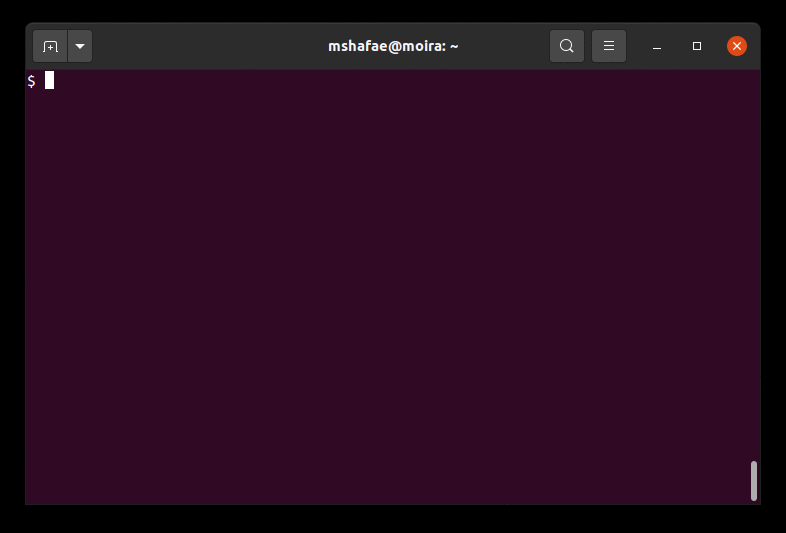

# Reflection & Making a Portfolio

The 16 week long semester is finally over and you have accomplished so much! You learned about problem solving and programming and created a portfolio of programs that demonstrate your competency and along the way you learned and improved your note taking and team work skills.

Our goal is to create an online resume or personal homepage which shows off some of your achievements. Ideally, you will add to this portfolio as you work on school related projects as well as your own personal projects.

If you do not have any experience or knowledge on how to make a web page, this will be your opportunity to learn how to create one. Over time, you can revisit, improve, and customize your web page to make your own personal corner of the Web stand out.

We shall use GitHub's service called [GitHub Pages](https://pages.github.com/) to host your web page in a GitHub repository. We shall use [Markdown](https://en.wikipedia.org/wiki/Markdown) instead of HTML to simplify creating our web pages.


## Background & Motivation

Sharing the fruits of our labor is an important part of the learning process and the mentoring process. To this end, it is beneficial to create our own little corner on the Internet where we can show off some of the cool things you have done.

GitHub is a lot more than just uploading and downloading code.

Consider where you will be in a few years. You may be looking to collaborate with some friends on writing software to address a family business need. Perhaps you will be applying for jobs and they ask you for your GitHub link. Invariably, your name comes up in a conversation and someone Googles your name - up comes your GitHub page. The next thing you know you've got a job iterview, an internship, or that independent study project you wanted to do gets approved.

Consider this as a first draft of what shall be many drafts of your personal home page. On this page, you can share a little bit of information about yourself and some of the topics you are interested in. As your programming skills evolve, you can add and remove projects to show your latest interests and achievements.


## Markdown

We shall start by creating a personal web page using [Markdown](https://en.wikipedia.org/wiki/Markdown) instead of HTML. Markdown is a human readable, lightweight markup language with a syntax that is easy to learn and use. Markdown is the markup language that your instructor uses for all the `README.md` files. The Markdown project's home page is https://daringfireball.net/projects/markdown/.

Everything you need to know can be learned from this Markdown cheat sheet, https://github.com/adam-p/markdown-here/wiki/Markdown-Cheatsheet and by looking at README.md files from past lab assignments. (Even this one!)

Students who are interested in having a page that looks fancier can use [HTML](https://www.w3schools.com/html/), [CSS](https://www.w3schools.com/css/default.asp), [JavaScript](https://www.w3schools.com/js/default.asp), [images](https://wordpress.org/openverse/), etc. however this is not required.

## Step 1: URL and Lab URLs

A _universal resource locator_ or _URL_ is the term we use to identify unique addresses on the World Wide Web. Casually in conversation, we may refer to a URL as a _link_. GitHub's URL or link is http://github.com and CSU Fullerton's is http://fullerton.edu.

Think about your three favorite lab exercises that you completed this semester. Below are the links to each Canvas lab assignment. *Bookmark or write down your favorite lab repositories or lab parts. You will need these URLs for the next step.*

* [Lab 02](https://csufullerton.instructure.com/courses/3381162/assignments/34485143)
* [Lab 03](https://csufullerton.instructure.com/courses/3381162/assignments/34562947)
* [Lab 04](https://csufullerton.instructure.com/courses/3381162/assignments/34596717)
* [Lab 05](https://csufullerton.instructure.com/courses/3381162/assignments/34609273)
* [Lab 06](https://csufullerton.instructure.com/courses/3381162/assignments/34624315)
* [Lab 07](https://csufullerton.instructure.com/courses/3381162/assignments/34637727)
* [Lab 08](https://csufullerton.instructure.com/courses/3381162/assignments/34650867)
* [Lab 09](https://csufullerton.instructure.com/courses/3381162/assignments/34662067)
* [Lab 10](https://csufullerton.instructure.com/courses/3381162/assignments/34685849)
* [Lab 11](https://csufullerton.instructure.com/courses/3381162/assignments/34697637)
* [Lab 12](https://csufullerton.instructure.com/courses/3381162/assignments/34727919)

## Step 2: Transferring Repositories

*If you did not bookmark your favorite repositories in Step 1, please go back and do that before continuing.*

The repositories that you used in your course are all owned by your instructor. After the semester is over, the repositories will be archived and then deleted. This means that if you want to save a copy of your work for your portfolio or for next semester, you will need to transfer the repository to your own GitHub account.

Use GitHub's [Importer](https://docs.github.com/en/github/importing-your-projects-to-github/importing-source-code-to-github/importing-a-repository-with-github-importer) to import your lab repositories into your personal GitHub account. GitHub has [instructions posted online](https://docs.github.com/en/github/importing-your-projects-to-github/importing-source-code-to-github/importing-a-repository-with-github-importer) with screenshots to help you navigate how to do it. If you get stuck or need help, ask your instructor or teaching associate for help.

The tricky part starts on _step 6_. This is where you provide your username and password to import your old repository (the one you used for this class) into the new repository (the repository you just created following GitHub's instructions). Attempt your GitHub password first. If this does not work, use your GitHub Personal Authentication Token (PAT).

If you do not know what your PAT is, just create a new one following [GitHub's PAT instrctions](https://docs.github.com/en/authentication/keeping-your-account-and-data-secure/creating-a-personal-access-token).


Verify that you have imported the repository by visiting your GitHub profile. If you do not see the repository in your profile then it did not transfer. Try following the steps again and if you continue to be unsuccessful ask an instructor for help. (To get to your profile, login to [GitHub](https://github.com/), click on your profile icon in the upper right hand corner, and then click on _Your profile_.)

## Step 3: Reflection

*Before continuing: please have your three favorite projects selected. Verify that you have transferred those repositories into your GitHub account. Seek assistance from your instructor if needed.*

For each of your favorite labs, write down in your notebook 1-2 sentences why that lab is your favorite and what you learned. Be specific about why you like the lab and what you learned. _It is part of your grade for this assignment!_

For example, in [Lab 07](https://csufullerton.instructure.com/courses/3381162/assignments/34637727) there were two parts. The first part was writing a program that calculates the number of days between two dates and the second part calculated the value of a Blackjack hand. One could write:

> Lab 7, part 2 was a favorite because I was always curious about how the game Blackjack works. I was able to write functions for the first time that calculate the correct value of a Blackjack hand no matter how many Aces were dealt.

Carefully and considerately write your reflection about your three favorite labs. Your spelling and grammar matter.


## Step 4: Your Home Page

*Before continuing: please have your reflections from Step 3 written down and ready to be published on the web. Check your spelling and grammar, use tools like Google Docs, Microsoft Word, and Grammarly to improve your writing.*

We will use [GitHub Pages](https://pages.github.com/) to host and serve your home page. GitHub Pages is a service where you create a git repository that contains HTML, CSS, JavaScript, images, etc. for your own personal home page and GitHub will serve those pages for you at no cost.

To create your own home page, follow the instructions given on https://pages.github.com. Make sure the _User or organization site_ button is selected and not _Project site_.

*Use the GitHub username that you have used in CPSC 120A. Using a different GitHub username will result in a missing assignment and a 0 (zero) grade.*

1. Log into GitHub, https://github.com
1. Create a new repository for your web pages. The name of the repository is very important. You must use your GitHub username as part of your repository name. For example, my GitHub login is `mshafae`. I created a new repository, https://github.com/new, and named the repository `mshafae.github.io`. *Replace `mshafae` with your GitHub username.*
1. We are using the _terminal git client_. Clone the repository to your computer using the `git clone` command. *Replace `mshafae` with your GitHub username.*
    ```sh
    git clone https://github.com/username/mshafae.github.io
    ```
1. Change directory to be inside your repository, `cd mshafae.github.io` for example. In this directory, using your text editor, VS Code, create a file named `index.md`. In the terminal, you can use the command `code index.md` and it will create the file `index.md` and open it for editing.
Start by adding the following into `index.md` and replace *your_username* with your GitHub username, *Your Name* with your name, and *your_major* with your major.
    
    Use the reflections that you wrote in the previous step to create a bulleted list of at least three projects from CPSC 120. Make sure that the links you use are correct by clicking the links and verifying that they load correctly. The previously used example is shown below.

    ```
    # Hello World
    This is my home page! My name is Your Name and I am a student at [Cal State Fullerton](http://www.fullerton.edu/) and my major is your_major.

    ## Computer Science Projects
    My GitHub page is http://github.com/your_username.

    ### CPSC 120

    * [Lab 7](http://github.com/your_username/the_link_to_your_repository)
    Lab 7, part 2 was a favorite because I was always curious about how the game Blackjack works. I was able to write functions for the first time that calculate the correct value of a Blackjack hand no matter how many Aces were dealt.

    ```
1. Save this file and add it to your repository with the `git add` command.
    ```sh
    $ git add index.md
    ```
1. Commit the changes to your git repository and push the changes back to GitHub using the `git commit` and `git push` commands.
    ```sh
    $ git commit -a -m "Initial commit of my home page."
    $ git push
    ```
1. If you have successfully created your `index.md` file and pushed it to GitHub, you can visit your own GitHub Pages URL to view your newly created page. For example, if your username is `mshafae`, then you would type `https://mshafae.github.io` in the address box of your web browser. Replace `mshafae` with your GitHub username.

If your changes did not appear online, then
1. Make sure you have the correct URL, remember it is github.io not github.com
1. Make sure you have committed and pushed your changes, look at the repository on GitHub.com to make sure the changes are there. Use `git status` to check the status of your files and repository.
1. Retrace all your steps

If you continue to have problems, please ask your instructor for help.

# Extras

## Images
Use some images to show off who you are and what you have accomplished. For example, the images you created in Labs 10 and 12 are beautiful and you can embed them into your page very easily.

For example, let us image that you have an image named `gradient.png` and we want to place the image in this page.

1. Create a directory in your repository named images using the `mkdir` command.
    ```sh
    $ mkdir images
    ```
1. Next identify where you have the file `gradient.png`. Let us assume that the file is located in `/home/mshafae/cpsc120/cpsc-120-lab-10-mshafae/part-3/gradient.png`. Copy the file into your new `images` directory.
    ```sh
    $ cp /home/mshafae/cpsc120/cpsc-120-lab-10-mshafae/part-3/gradient.png images
    ```
1. Add the `images` directory to your repository, including the image you just copied using the `git add` command.
    ```sh
    $ git add images
    ```
1. In the file `index.md`, using VS Code, add Markdown text to embed the image into your page. This will place the image in the file when you view it through your web browser.
    ```
    
    ```
1. Save the changes you made to `index.md`, commit and push your changes.
    ```sh
    $ git commit -a -m "Added an image to my index.md"
    $ git push
    ```
1. If you have successfully embedded an image into your `index.md` file and pushed it to GitHub, you can visit your own GitHub Pages URL. For example, if your username is `mshafae`, then you would type `https://mshafae.github.io` in the address box of your web browser. Replace `mshafae` with your GitHub username.

Below is an example of how to embed an image into this page using the Markdown code ``.


## GIF Screencasts

You can make your links to your projects more interesting by using animated GIFs of your terminal. You can create animated gifs using [ttyrec](https://en.wikipedia.org/wiki/Ttyrec) with [ttygif](https://github.com/icholy/ttygif) or [terminalizer](https://www.terminalizer.com). On Ubuntu Linux, you can easily install packages `ttyrec`, `ttygif`, and `xdotool` with the command `sudo apt install ttyrec ttygif xdotool`. Below is an animated GIF of the installation process.


Once you have the tools installed, you can create GIFs demonstrating your programs like the one below demonstrating a _Hello World!_ program that we wrote back in Week 1.



If you run into a problem where the `ttygif` program throws an error and says `Error: WINDOWID environment variable was empty.`, then there is a simple fix for Ubuntu Linux using `xdotool` given on the [`ttygif` README](https://github.com/icholy/ttygif/blob/master/README.md).

If you're on Ubuntu, you can use `xdotool` to find the WINDOWID
``` sh
$ sudo apt-get install xdotool
$ export WINDOWID=$(xdotool getwindowfocus)
```

Paul Czarkowski has some [brief instructions](https://medium.com/@pczarkowski/how-to-make-an-animated-gif-of-your-terminal-commands-62b08dfb6089) on how to create an animated GIF and then optimize it using [`gifsicle`](http://www.lcdf.org/gifsicle/) to make the file size smaller.

# Rubric
In the file homepage.txt, write your GitHub Pages URL and push it to your repository.


https://help.github.com/en/github/working-with-github-pages/configuring-a-custom-domain-for-your-github-pages-site

https://domains.google.com/
